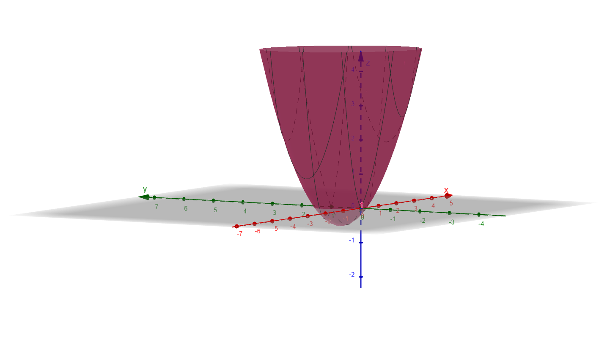

Tarefa 1
a) 
b) vetor gradiente f(x,y) = (6x + 3y - 1; 3x + 4y - 2)
c)código
d) Passo (α),"Ponto de Mínimo (x, y)",Iterações
    α=0.1,"(-0.133310, 0.599967)",47
    α=0.15,"(-0.133318, 0.599979)",31
    α=0.2,"(-0.133328, 0.599997)",25
    α=0.3,(Divergiu)", >10000
    α=0.5,(Divergiu),> 10000

Tarefa 2: 
Pontos de mínimo: 
Iniciando em (0, 0): (0.839272, 0.000000) (obtido em 19 iterações com α =0.1)
Iniciando em (-1, 0): (0.839271, 0.000000) (obtido em 20 iterações com α =0.1)

Modificação necessária: 
A modificação necessária foi alterar o ponto inicial (x0, y0), de (0, 0) para (-1, 0)

Comportamento da convergência:
valores de α (ex: 0.1, 0.15) convergem bem. Valores maiores (ex: α = 0.3) já causam oscilação e demora na convergência

Tarefa 3:
Pontos de máximo:
Iniciando em (0, 0): (-0.163337, -0.236612) (obtido em 18 iterações com α =0.1)
Iniciando em (2, 3): (1.884534, 2.801994) (obtido em 13 iterações com α =0.1)

Tarefa Desafio: 
Melhor Passo Fixo (α = 0.2): 25 iterações
Passo Variável: 11 iterações