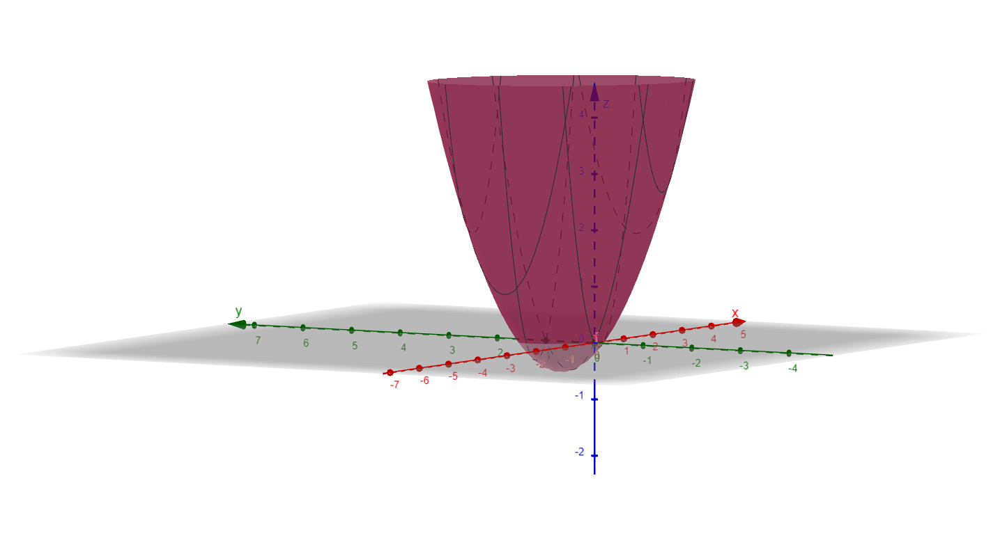

# Relatório de Atividades - Cálculo e Otimização

## Tarefa 1

**a) Visualização**

**b) Vetor Gradiente**
$$f(x,y) = (6x + 3y - 1; 3x + 4y - 2)$$

**c) Código**
O código da implementação foi incluído no arquivo principal deste repositório.

**d) Análise de Convergência**

| Passo ($\alpha$) | Ponto de Mínimo $(x, y)$ | Iterações |
| :--- | :--- | :--- |
| $\alpha = 0.1$ | $(-0.133310, 0.599967)$ | 47 |
| $\alpha = 0.15$ | $(-0.133318, 0.599979)$ | 31 |
| $\alpha = 0.2$ | $(-0.133328, 0.599997)$ | 25 |
| $\alpha = 0.3$ | Divergiu | $> 10000$ |
| $\alpha = 0.5$ | Divergiu | $> 10000$ |

---

## Tarefa 2

### Pontos de Mínimo Encontrados:
* **Início em $(0, 0)$:** $(0.839272, 0.000000)$ 
  * Obtido em **19 iterações** com $\alpha = 0.1$
* **Início em $(-1, 0)$:** $(0.839271, 0.000000)$ 
  * Obtido em **20 iterações** com $\alpha = 0.1$

### Modificação Necessária:
A modificação realizada foi a alteração do ponto inicial $(x_0, y_0)$, mudando de $(0, 0)$ para $(-1, 0)$.

### Comportamento da Convergência:
Valores de $\alpha$ baixos (ex: 0.1, 0.15) convergem bem e com estabilidade. Valores maiores (ex: $\alpha = 0.3$) já causam oscilação e demora excessiva na convergência.

---

## Tarefa 3

### Pontos de Máximo:
* **Iniciando em $(0, 0)$:** $(-0.163337, -0.236612)$ 
  * Obtido em **18 iterações** com $\alpha = 0.1$
* **Iniciando em $(2, 3)$:** $(1.884534, 2.801994)$ 
  * Obtido em **13 iterações** com $\alpha = 0.1$

---

## Tarefa Desafio

| Método | Configuração | Iterações |
| :--- | :--- | :--- |
| **Melhor Passo Fixo** | $\alpha = 0.2$ | 25 |
| **Passo Variável** | Dinâmico | **11** |
